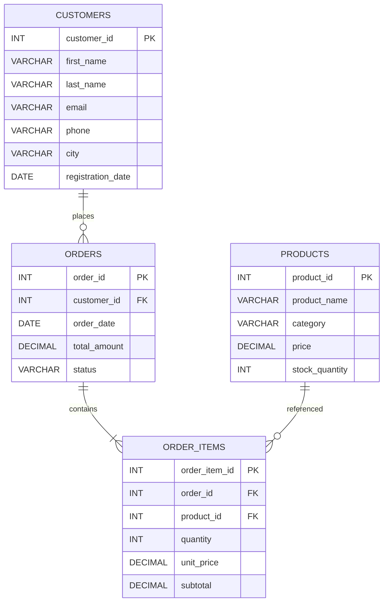

# FlexiMart Database Schema Documentation

## 1. Entity-Relationship Description (Text Format)

### ENTITY: customers
- **Purpose:** Stores customer information.
- **Attributes:**
  - `customer_id`: Unique identifier (Primary Key)
  - `first_name`: Customer's first name
  - `last_name`: Customer's last name
  - `email`: Customer's email address
  - `phone`: Customer's phone number
  - `city`: Customer's city
  - `registration_date`: Date of registration
- **Relationships:**
  - One customer can place **many** orders (1:M with orders table)

---

### ENTITY: products
- **Purpose:** Stores product information.
- **Attributes:**
  - `product_id`: Unique identifier (Primary Key)
  - `product_name`: Name of the product
  - `category`: Product category
  - `price`: Product price
  - `stock_quantity`: Quantity in stock
- **Relationships:**
  - One product can appear in **many** order items (1:M with order_items table)

---

### ENTITY: orders
- **Purpose:** Stores order information.
- **Attributes:**
  - `order_id`: Unique identifier (Primary Key)
  - `customer_id`: References customer (Foreign Key)
  - `order_date`: Date of the order
  - `total_amount`: Total amount for the order
  - `status`: Order status
- **Relationships:**
  - One order can have **many** order items (1:M with order_items table)
  - Each order is placed by **one** customer (M:1 with customers table)

---

### ENTITY: order_items
- **Purpose:** Stores individual items within an order.
- **Attributes:**
  - `order_item_id`: Unique identifier (Primary Key)
  - `order_id`: References order (Foreign Key)
  - `product_id`: References product (Foreign Key)
  - `quantity`: Quantity of the product ordered
  - `unit_price`: Price per unit
  - `subtotal`: Total price for this item
- **Relationships:**
  - Each order item is linked to **one** order and **one** product (M:1 with orders and products tables)

---

## 2. Normalization Explanation

The FlexiMart database schema is designed to be in **Third Normal Form (3NF)**, ensuring data integrity, eliminating redundancy, and supporting efficient data operations.

### Why the Schema is in 3NF

- **First Normal Form (1NF):**  
  Each table has a primary key, and all fields contain only atomic (indivisible) values. There are no repeating groups or arrays; for example, each order item is a separate row in the `order_items` table.
- **Second Normal Form (2NF):**  
  All non-key attributes are fully functionally dependent on the entire primary key. Since all tables use a single-column primary key (except `order_items`, which uses `order_item_id` as a surrogate key), there are no partial dependencies.
- **Third Normal Form (3NF):**  
  There are no transitive dependencies. Non-key attributes do not depend on other non-key attributes. For example, in the `orders` table, `total_amount` depends only on `order_id`, not on `customer_id` or any other non-key attribute.

### Functional Dependencies

- **customers:**  
  All attributes (`first_name`, `last_name`, `email`, `phone`, `city`, `registration_date`) are fully functionally dependent on the primary key `customer_id`.
- **products:**  
  All attributes (`product_name`, `category`, `price`, `stock_quantity`) are fully functionally dependent on the primary key `product_id`.
- **orders:**  
  All attributes (`customer_id`, `order_date`, `total_amount`, `status`) are fully functionally dependent on the primary key `order_id`. `customer_id` is a foreign key referencing `customers`.
- **order_items:**  
  All attributes (`order_id`, `product_id`, `quantity`, `unit_price`, `subtotal`) are fully functionally dependent on the primary key `order_item_id`. `order_id` and `product_id` are foreign keys referencing `orders` and `products` respectively.

### How the Design Avoids Anomalies

- **Update Anomaly:**  
  Product details (such as price and stock) are stored only in the `products` table. If a product's price changes, it is updated in one place, preventing inconsistent data across multiple records.
- **Insert Anomaly:**  
  The use of foreign keys ensures that an order cannot be created without an existing customer, and an order item cannot be created without an existing order and product. This maintains referential integrity and prevents orphan records.
- **Delete Anomaly:**  
  Deleting a customer or product will not result in loss of order or order item data, as foreign key constraints can be set to restrict or cascade deletions appropriately. This prevents accidental data loss and maintains consistency.

### Summary

By organizing data into separate, well-structured tables and linking them through foreign keys, the schema:
- Eliminates redundancy (no duplicate customer or product data in orders or order items)
- Ensures that each fact is stored in only one place
- Maintains data integrity through enforced relationships
- Supports efficient updates, inserts, and deletes without risk of anomalies

This robust normalization supports scalability, consistency, and reliability for FlexiMart’s transactional data.

---

## 3. Sample Data Representation

### customers

| customer_id | first_name | last_name | email              | phone         | city   | registration_date |
|-------------|------------|-----------|--------------------|--------------|--------|-------------------|
| 1           | Alice      | Smith     | alice@example.com  | +91-9876543210 | Delhi  | 2023-01-15        |
| 2           | Bob        | Johnson   | bob@example.com    | +91-9123456789 | Mumbai | 2023-02-20        |

---

### products

| product_id | product_name | category    | price | stock_quantity |
|------------|--------------|-------------|-------|---------------|
| 1          | Laptop       | Electronics | 55000 | 10            |
| 2          | T-Shirt      | Fashion     | 499   | 50            |

---

### orders

| order_id | customer_id | order_date | total_amount | status   |
|----------|-------------|------------|--------------|----------|
| 1        | 1           | 2023-03-01 | 55500        | Shipped  |
| 2        | 2           | 2023-03-05 | 998          | Pending  |

---

### order_items

| order_item_id | order_id | product_id | quantity | unit_price | subtotal |
|---------------|----------|------------|----------|------------|----------|
| 1             | 1        | 1          | 1        | 55000      | 55000    |
| 2             | 2        | 2          | 2        | 499        | 998      |

---

# 4. ER Diagram for FlexiMart Database

