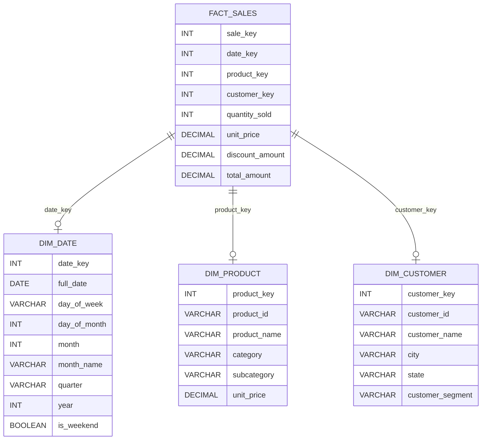

# Star Schema Design for FlexiMart Data Warehouse

---

## **Section 1: Schema Overview**

FACT TABLE: `fact_sales`  
Grain: One row per product per order line item  
Business Process: Sales transactions  

**Measures (Numeric Facts):**
- quantity_sold: Number of units sold
- unit_price: Price per unit at time of sale
- discount_amount: Discount applied
- total_amount: Final amount (quantity × unit_price - discount)

**Foreign Keys:**
- date_key → dim_date
- product_key → dim_product
- customer_key → dim_customer

---

DIMENSION TABLE: `dim_date`  
Purpose: Date dimension for time-based analysis  
Type: Conformed dimension  
Attributes:
- date_key (PK): Surrogate key (integer, format: YYYYMMDD)
- full_date: Actual date
- day_of_week: Monday, Tuesday, etc.
- day_of_month: 1–31
- month: 1–12
- month_name: January, February, etc.
- quarter: Q1, Q2, Q3, Q4
- year: 2023, 2024, etc.
- is_weekend: Boolean

---

DIMENSION TABLE: `dim_product`  
Purpose: Product details for category analysis  
Attributes:
- product_key (PK): Surrogate key
- product_id: Natural key from source
- product_name: Name of product
- category: Electronics, Grocery, Apparel
- subcategory: Laptop, Mobile, etc.
- unit_price: Standard price

---

DIMENSION TABLE: `dim_customer`  
Purpose: Customer details for segmentation  
Attributes:
- customer_key (PK): Surrogate key
- customer_id: Natural key from source
- customer_name: Full name
- city: Customer city
- state: Customer state
- customer_segment: Retail, Corporate, etc.

---

## Section 2: Design Decisions

**1. Why you chose this granularity (transaction line-item level):**  
Transaction line-item granularity was chosen to capture every product sold in each transaction, providing highly detailed and flexible data for analysis. This level of detail enables accurate tracking of sales trends, customer behavior, and product performance, while supporting advanced analytics such as basket analysis and cross-selling opportunities.

**2. Why surrogate keys instead of natural keys:**  
Surrogate keys are used as primary keys in dimension tables because they ensure uniqueness and consistency, regardless of changes in business data. Unlike natural keys, which may change or lack uniqueness, surrogate keys are system-generated and immutable, simplifying data integration, maintenance, and supporting slowly changing dimensions.

**3. How this design supports drill-down and roll-up operations:**  
The star schema’s structure, with dimension tables for date, product, and customer, and a fact table at the transaction line-item level, enables efficient drill-down and roll-up operations. Analysts can easily aggregate data from year to quarter to month, or break down by product category or customer segment, supporting comprehensive and actionable business insights.

---

## **Section 3: Sample Data Flow**

### Source Transaction - How it flows into the Data Warehouse (Star Schema)

1. **Dimension Tables Population**
   - **dim_date**: The transaction date (e.g., '2024-01-16') is assigned a surrogate key (`date_key: 20240116`). Other attributes like month, quarter, and year are also stored.
        ```
        dim_date: {date_key: 20240116, full_date: '2024-01-16', day_of_week: 'Tuesday', day_of_month: 16, month: 1, month_name: 'January', quarter: 'Q1', year: 2024, is_weekend: 0}
        ``` 
   
   - **dim_product**: The product "Breakfast Cereals" is assigned a surrogate key (`product_key: 39`). Its details (product name, product category, product subcategory etc.) are stored in this table.
        ```
        dim_product: {product_key: 39, product_id: 'P039', product_name: 'Breakfast Cereals', category: 'Groceries', subcategory: 'Packaged Food', unit_price: 250.00}
        ```    
  
   - **dim_customer**: The customer "Vikram Patel" is assigned a surrogate key (`customer_key: 5`). Additional details (city, segment, etc.) are stored.
      ```
     dim_customer: {customer_key: 5, customer_id: 'C005', customer_name: 'Vikram Patel', city: 'Chennai', state: 'Tamil Nadu', customer_segment: 'Corporate'}
    ```

2. **Fact Table Population**
   - **fact_sales**: The transaction is recorded as a line item:
     ```
     fact_sales: {
       date_key: 20240116,
       product_key: 39,
       customer_key: 5,
       quantity_sold: 1,
       unit_price: 250,
       discount_amount: 11.06
       total_amount: 238.94
     }
     ```
   - This row references the surrogate keys from the dimension tables, linking all relevant context.

### Summary of Flow

- The source transaction is split into its components and loaded into the respective dimension tables (date, product, customer).
- The fact table captures the transaction at the most granular level, referencing the dimension tables via surrogate keys.
- This structure allows for powerful analytics, such as tracking sales by date, product, or customer, and supports drill-down and roll-up operations.


---

## ER Diagram

Below is the ER diagram for the Fleximart Data Warehouse star schema:


